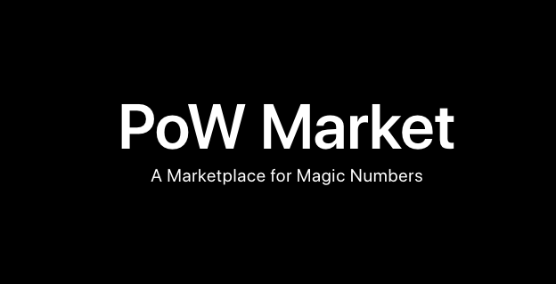

# PoW Market



> A market for magic numbers

https://pow.market/


## Getting Started

To get the PoW market running, use the following commands

**Dependencies**
- MongoDB
- Bitcoin node

```bash
git clone https://github.com/synfonaut/pow.market.git
cd pow.market
npm i
RPC_HOST=XXX RPC_USER=XXX RPC_PASS=XXX PEER_HOST=XXX npm start


(in a new shell)
RPC_HOST=XXX RPC_USER=XXX RPC_PASS=XXX PEER_HOST=XXX npm run state_machine
```

Pull requests welcome!


## API

The PoW Market API has 3 `HTTP` `GET` endpoints available that all return objects like this:

```javascript
{
  "bsvusd": 233.8,
  "magicnumbers": [
    {
      "txid": "192247cbdcb862146976b84773c68b3d3bbd1caafff25654188b746f9e4af9d5",
      "vout": 0,
      "from": "189GjWCxxfWnzoCiagi4fQ1m3VBDVbJhkm",
      "value": 939960,
      "confirmed": false,
      "magicnumber": "21e800",
      "target": "21e80096c21e2de52d741ac27607e251770c0b9f7e644f684cf37173e871820e",
      "mined": false,
      "created_at": 1583110006
    },
    ...
   ]
}
```

Objects will have `mined` set to `true` or `false`.


### `https://pow.market/api`

Return all magic numbers in the order they were created. Currently no paging is offered.


### `https://pow.market/api/unmined`

Return all unmined magic numbers.


### `https://pow.market/api/mined`

Return the last 500 mined magic numbers. Currently no paging is offered. Mined objects will have additional properties like `mined_address`, `mined_number` and `mined_txid`.

```js
{
  "bsvusd": 233.8,
  "magicnumbers": [
    {
      "txid": "45bccbfc54ebd965009c655158542f20860e3cb842764d711e4c0db43477cdb1",
      "vout": 0,
      "from": "1JhWWtdWJmaWLdpT2E2zqs7DNwEtzbwcLB",
      "value": 9427,
      "confirmed": true,
      "magicnumber": "21e8",
      "target": "21e80096c21e2de52d741ac27607e251770c0b9f7e644f684cf37173e871820e",
      "mined": true,
      "created_at": 1583109241,
      "mined_address": "1HBDCouZ5Fzo9LMp7SfVjVXDRguLyMoUWz",
      "mined_number": "21e8e01d4d51bc3fbd29b91e3e3034407b0c72b687d6853b13c4a49e19933238",
      "mined_txid": "e1a458d12429d4d3c96348e46da9f88601cc7942091d2558533d2738ca719a56"
    },
    ...
]}
```


## 21e8miner

PoW Market is compatible with [21e8miner](https://github.com/deanmlittle/21e8miner)


## About

PoW Market is a distributed proof-of-work market built on Bitcoin. It's built using Hummingbird (https://github.com/synfonaut/hummingbird), a real-time application framework for Bitcoin.

@synfonaut

Block visualization inspired by https://bitcoinblocks.live/

## EarnSV Bounties

### Add scripts from Brendan ($21.80)

These scripts are claimable but use a slightly different Bitcoin Script format. Adjust the script identifier [here](https://github.com/synfonaut/powmarket/blob/master/src/state_machine.js#L78) to recognize these scripts:

```
https://whatsonchain.com/tx/878e46d9b8292273ff2c7bbdcf1d3de17564132785fa3af4cadac139b62c448c
https://whatsonchain.com/tx/b4ce678e495df5e793301092619a636282e4b83f80a572b06b29b623ba10a5ab
https://whatsonchain.com/tx/ff5be755d27ee11c74fd7d825927cbb7d4e78f1c35e5a6449f68ab924025d112
https://whatsonchain.com/tx/60a04a616061c3a545c2cb39b8a1c1f848b3764115adc0149615511887ebeb7e
```


### Add WebSockets API ($21.80)

There are many NodeJS WebSocket APIs, switch the state_machine to use one that pushes state changes live to subscribers.


### Add Market Hashpower ($21.80)

How much hashpower is currently flowing through the market? Calculate and display it on homepage.


### Design and UX ($2.18)

Make improvements to the design / UX.
